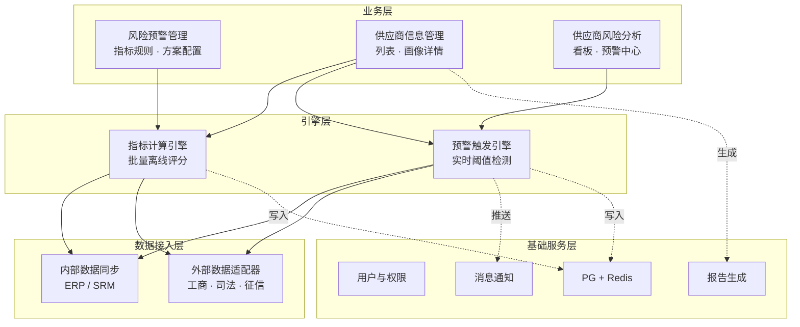
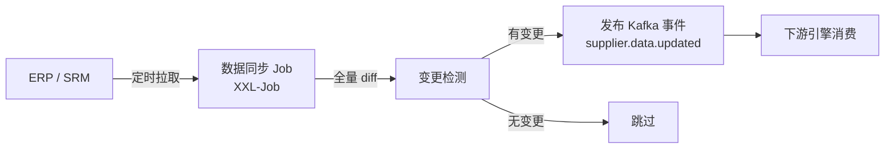
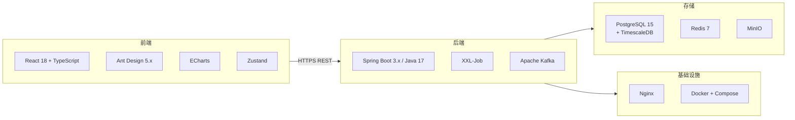
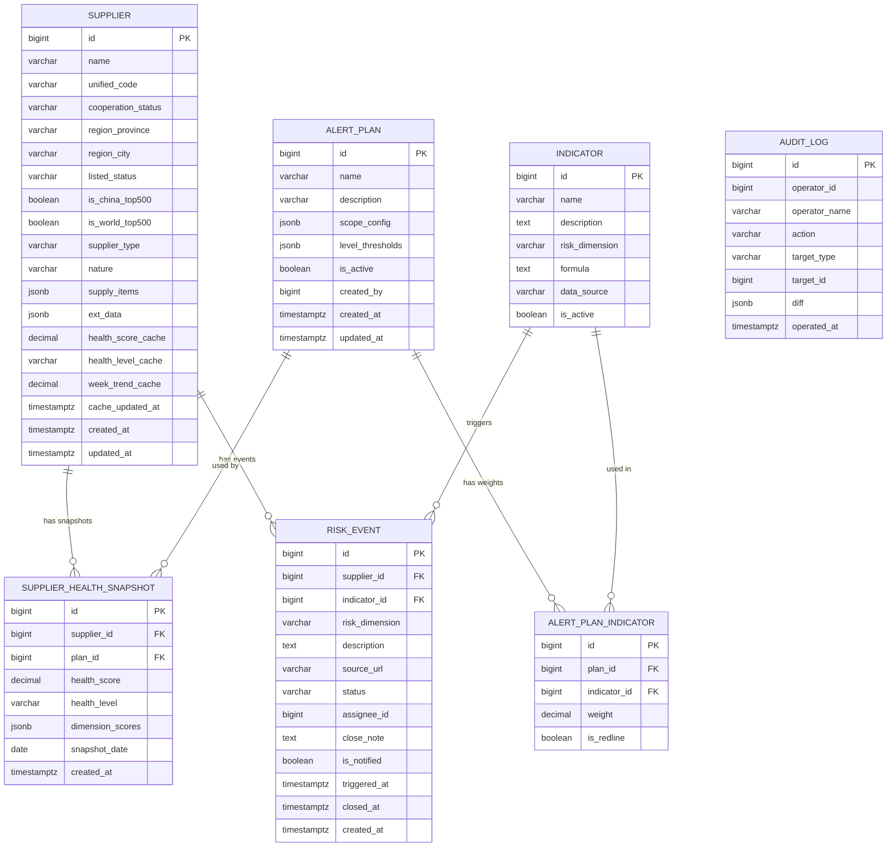
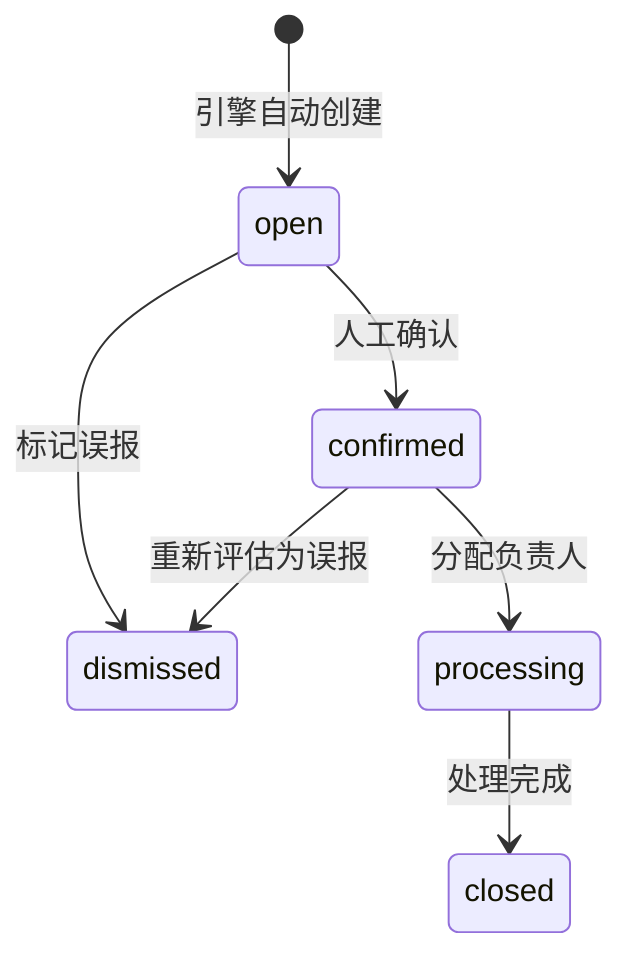
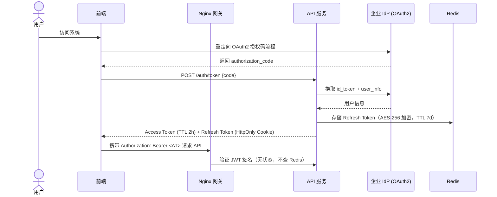
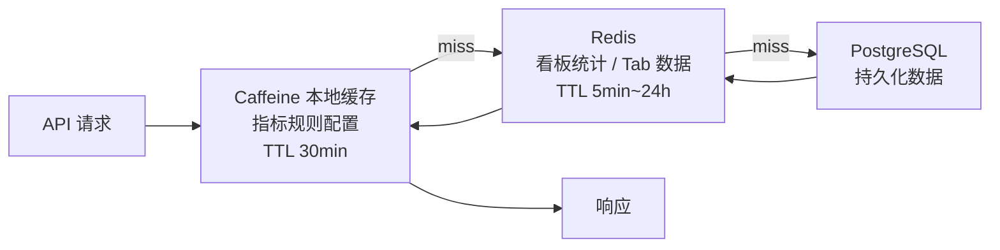
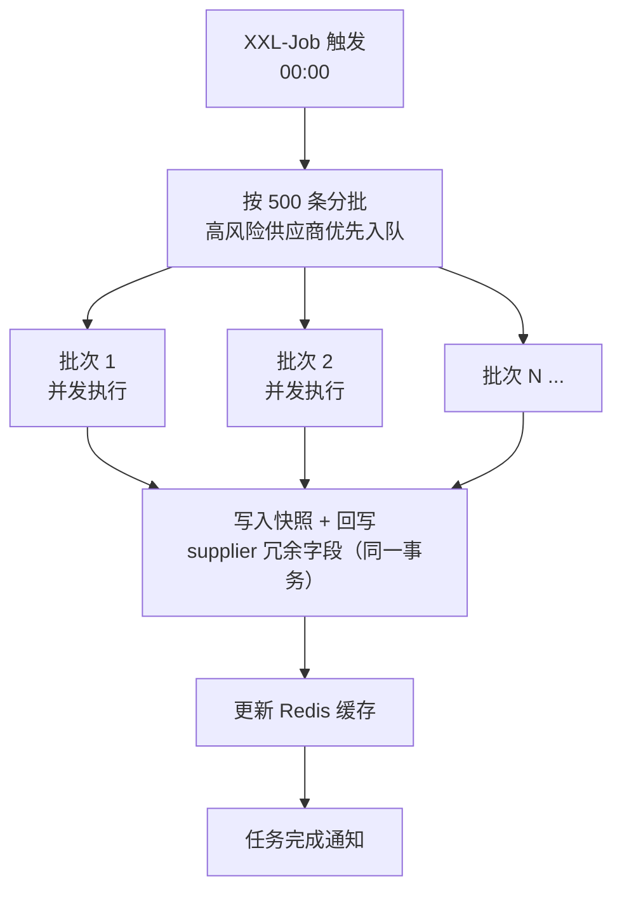
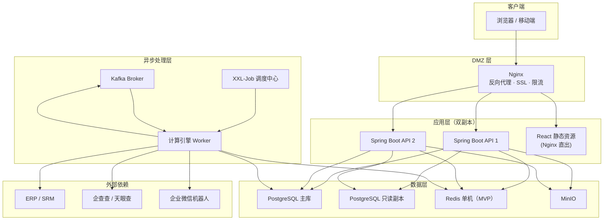
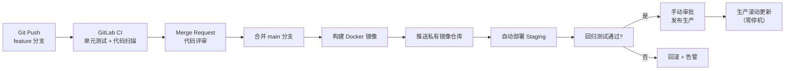

# 供应链风险管理平台 — 技术方案文档

> **文档版本：** v2.0
> **基于产品方案：** 供应链风险管理平台 V1.3（2026-03-18）
> **编写日期：** 2026-03-20
> **作者：** 技术团队
> **状态：** 待评审

### 版本变更记录

| 版本 | 日期       | 变更说明                                                                                                                                                                                           |
| ---- | ---------- | -------------------------------------------------------------------------------------------------------------------------------------------------------------------------------------------------- |
| v1.0 | 2026-03-20 | 初稿                                                                                                                                                                                               |
| v2.0 | 2026-03-20 | 基于评审意见修订：修复复合索引字段错误；alert_plan 权重独立成关联表；risk_event 补充状态流转；report_url 改为预签名方案；接口拆分 Tab 懒加载；补充游标分页、限流细化、SQL 注入防护、线程池参数配置 |

---

## 目录

1. [项目背景与目标](#1-项目背景与目标)
2. [核心模块划分](#2-核心模块划分)
3. [技术栈选型](#3-技术栈选型)
4. [核心数据模型设计](#4-核心数据模型设计)
5. [关键接口设计](#5-关键接口设计)
6. [安全设计](#6-安全设计)
7. [性能设计](#7-性能设计)
8. [部署架构与环境规划](#8-部署架构与环境规划)
9. [风险点与 Mitigation 方案](#9-风险点与-mitigation-方案)
10. [附录](#10-附录)

---

## 1. 项目背景与目标

### 1.1 业务背景

采购与供应链部门在日常管理中面临四大核心痛点：

| 痛点         | 描述                                 | 影响                       |
| ------------ | ------------------------------------ | -------------------------- |
| 风险管理滞后 | 缺乏主动识别机制，风险发生后才知晓   | 无法提前干预，损失被动承受 |
| 风险点增多   | 供应链复杂度上升，潜在风险点持续增加 | 人工排查成本线性增长       |
| 管控闭环缺失 | 风险识别后缺乏有效跟踪与闭环管理     | 已知风险无人跟进，重复暴露 |
| 数据孤岛严重 | 内外部数据未打通，难以形成全局视角   | 决策依赖局部信息，误判率高 |

### 1.2 本期目标（03.31 MVP）

以**供应商风险管理**为试点，完成三项核心交付：

1. **数据接入**：供应商内外部核心数据打通（合作状态、司法、信用、税务等）
2. **模型搭建**：基础风险评分模型（红线指标 + 常规指标加权）
3. **功能闭环**：风险预警配置 → 预警推送 → 供应商画像 → 风险看板的完整链路跑通

### 1.3 技术目标

| 指标               | 目标值             | 说明                               |
| ------------------ | ------------------ | ---------------------------------- |
| 系统可用性         | ≥ 99.5%            | 非核心交易链路，允许计划内维护窗口 |
| 预警推送延迟       | ≤ 5 分钟           | 从数据更新到企微/邮件通知到达      |
| 列表页响应时间     | P95 ≤ 800ms        | 含筛选，数据量 ≤ 10,000 供应商     |
| 画像主接口响应时间 | P95 ≤ 500ms        | 首屏核心数据，Tab 数据懒加载       |
| 批量评分完成时间   | ≤ 4 小时           | 10,000 供应商，窗口期 00:00–04:00  |
| 数据接入可扩展性   | 新增数据源无需停机 | 适配器模式隔离变化                 |

---

## 2. 核心模块划分

### 2.1 模块总览



### 2.2 子模块详细说明

#### 2.2.1 数据接入层

**职责边界：** 负责将异构数据源统一转换为平台内部标准数据格式，下游模块不感知数据来源。

| 子模块         | 输入                                   | 输出                        | 设计理由                                                                |
| -------------- | -------------------------------------- | --------------------------- | ----------------------------------------------------------------------- |
| 内部数据同步   | ERP/SRM 接口或数据库视图               | 供应商基础信息标准格式 JSON | 内部数据为权威数据源，采用全量 + 增量双模式，全量每日一次，增量事件驱动 |
| 外部数据适配器 | 各第三方 API（工商、司法、征信、税务） | 标准化供应商外部信息 JSON   | 适配器模式隔离三方接口变化，新增数据源只需新增一个适配器类              |

**内部数据同步流程：**



**外部数据适配器接口约定（内部）：**

```java
public interface ExternalDataAdapter {
    String getSource();
    SupplierExternalData fetchByUnifiedCode(String unifiedCode);
    boolean isAvailable();
}
```

#### 2.2.2 风险引擎

| 子模块       | 触发方式                | 输入                       | 输出                                                       | 性能要求           |
| ------------ | ----------------------- | -------------------------- | ---------------------------------------------------------- | ------------------ |
| 指标计算引擎 | XXL-Job 每日 00:00      | 全量供应商 + 激活预警方案  | supplier_health_snapshot 记录 + 回写 supplier 冗余缓存字段 | 10,000 供应商 ≤ 4h |
| 预警触发引擎 | Kafka Consumer 实时消费 | supplier.data.updated 事件 | risk_event 记录 + 通知推送                                 | 单条事件处理 ≤ 30s |

**评分公式：**

```
企业风险总分 = 100 - Σ(指标得分 × 对应权重)
企业风险维度分 = 100 - Σ(该维度下各指标得分 × 对应权重)
红线指标：任意一项触发 → 总分直接归零（0 分）
```

**健康等级映射（默认值，可通过预警方案配置覆盖）：**

| 等级   | 分值区间  | 颜色标识 |
| ------ | --------- | -------- |
| 低风险 | [70, 100] | 绿色     |
| 需关注 | [40, 70)  | 橙色     |
| 高风险 | [0, 40)   | 红色     |

#### 2.2.3 风险预警管理

| 子模块       | 输入       | 输出                                         | 安全约束                                                                           |
| ------------ | ---------- | -------------------------------------------- | ---------------------------------------------------------------------------------- |
| 指标规则配置 | 管理员操作 | indicator 表记录                             | 仅超级管理员可写；所有人可读                                                       |
| 预警方案配置 | 管理员操作 | alert_plan + alert_plan_indicator 关联表记录 | 仅超级管理员操作；权重总和须等于 100%（DB + 应用层双重校验）；激活方案不可直接删除 |

#### 2.2.4 供应商信息管理

| 子模块                        | 输入                | 输出                                                    | 性能约束                        |
| ----------------------------- | ------------------- | ------------------------------------------------------- | ------------------------------- |
| 供应商列表                    | 筛选条件 + 分页参数 | 分页供应商列表（健康分/趋势来自 supplier 冗余缓存字段） | P95 ≤ 800ms；支持游标分页       |
| 供应商画像主接口              | supplier_id         | 基础信息 + 健康评分卡 + 前 5 条风险事项                 | P95 ≤ 500ms（首屏核心数据）     |
| 供应商画像 Tab 接口（懒加载） | supplier_id         | 各 Tab 独立数据，用户切 Tab 触发                        | P95 ≤ 1s；各 Tab 独立超时与降级 |

**画像 Tab 数据来源与缓存：**

| Tab      | 接口路径                             | 数据来源     | Redis TTL |
| -------- | ------------------------------------ | ------------ | --------- |
| 基本信息 | `/suppliers/{id}/tabs/basic-info`    | ERP/SRM      | 24h       |
| 经营信息 | `/suppliers/{id}/tabs/business-info` | 工商（外部） | 24h       |
| 司法诉讼 | `/suppliers/{id}/tabs/judicial`      | 司法（外部） | 24h       |
| 信用数据 | `/suppliers/{id}/tabs/credit`        | 征信（外部） | 24h       |
| 税务信息 | `/suppliers/{id}/tabs/tax`           | 税务（外部） | 24h       |

> **设计理由：** 各 Tab 来自不同外部数据源，响应时间差异大。原方案合并在一个接口导致最慢数据源决定整体响应时间。拆分后主接口返回首屏核心数据（P95 ≤ 500ms），Tab 数据懒加载，独立降级不互相影响。

#### 2.2.5 供应商风险分析

| 子模块       | 输入            | 输出                                      | 性能约束                      |
| ------------ | --------------- | ----------------------------------------- | ----------------------------- |
| 风险看板     | 无（全局统计）  | 各等级数量、趋势、Top 10、评分列表        | P95 ≤ 500ms（Redis 缓存命中） |
| 风险预警中心 | 筛选条件 + 分页 | 今日新增数量 + 风险事项列表（含处理状态） | P95 ≤ 800ms                   |

---

## 3. 技术栈选型

### 3.1 选型总览



### 3.2 后端

| 技术         | 版本   | 用途         | 选型理由                                         |
| ------------ | ------ | ------------ | ------------------------------------------------ |
| Java         | 17 LTS | 主语言       | 团队熟悉度高；虚拟线程提升 IO 并发能力           |
| Spring Boot  | 3.x    | Web 框架     | 生态成熟；Spring Security 鉴权集成简单           |
| XXL-Job      | 2.4.x  | 分布式调度   | 轻量，可视化监控；满足每日批量计算需求           |
| Apache Kafka | 3.x    | 消息队列     | 解耦数据接入与引擎消费；高吞吐；消息持久化可回放 |
| HikariCP     | —      | 数据库连接池 | Spring Boot 默认性能最优；连接池参数见第 7 节    |
| Caffeine     | —      | 本地缓存     | 应用内热数据缓存（指标规则），无网络开销         |

### 3.3 前端

| 技术        | 版本 | 用途     | 选型理由                                 |
| ----------- | ---- | -------- | ---------------------------------------- |
| React       | 18   | UI 框架  | 组件化开发，配合 TypeScript 降低维护成本 |
| TypeScript  | 5.x  | 类型系统 | 编译期发现接口字段错误，减少联调返工     |
| Ant Design  | 5.x  | 组件库   | 企业级中后台组件丰富，减少重复开发       |
| ECharts     | 5.x  | 图表     | 折线图、排行榜能力强，定制化程度高       |
| Zustand     | 4.x  | 状态管理 | 轻量，适合中等复杂度状态管理             |
| React Query | 5.x  | 数据请求 | 自动缓存 + 后台刷新 + 加载状态管理       |

### 3.4 数据库与存储

| 技术        | 版本       | 用途           | 选型理由                                                     |
| ----------- | ---------- | -------------- | ------------------------------------------------------------ |
| PostgreSQL  | 15         | 主数据库       | 支持 JSONB；`pg_trgm` 扩展支持全文搜索；行级安全可选         |
| TimescaleDB | 2.x        | 时序趋势数据   | 复用 PG，满足近 7/30 天趋势查询；MVP 阶段无需引入独立时序 DB |
| Redis       | 7          | 缓存 + Session | 读多写少场景；TTL 自动失效；Lua 原子操作防击穿               |
| MinIO       | 最新稳定版 | 文件存储       | 报告 PDF 存储；兼容 S3；通过预签名 URL 控制访问权限          |

### 3.5 中间件与基础设施

| 技术             | 用途                     | 备注                               |
| ---------------- | ------------------------ | ---------------------------------- |
| Nginx            | 反向代理、SSL 终止、限流 | 限流配置见第 6.3 节                |
| Docker + Compose | 容器化、本地开发         | MVP 阶段；后续迁移 K8s             |
| GitLab CI        | CI/CD 流水线             | 构建 → 推送 → 部署                 |
| Vault / 配置中心 | 密钥管理                 | API Key、DB 密码加密，不进代码仓库 |

---

## 4. 核心数据模型设计

### 4.1 ER 概览



### 4.2 核心表 DDL

#### supplier（供应商主表）

```sql
CREATE TABLE supplier (
    id                  BIGSERIAL PRIMARY KEY,
    name                VARCHAR(200)    NOT NULL,
    unified_code        VARCHAR(50)     UNIQUE,
    cooperation_status  VARCHAR(20)     NOT NULL DEFAULT 'potential',
    -- 枚举值: cooperating/potential/qualified/blacklist/restricted
    region_province     VARCHAR(50),
    region_city         VARCHAR(50),
    listed_status       VARCHAR(10),
    -- 枚举值: listed/unlisted
    is_china_top500     BOOLEAN         NOT NULL DEFAULT FALSE,
    is_world_top500     BOOLEAN         NOT NULL DEFAULT FALSE,
    supplier_type       VARCHAR(20),
    -- 枚举值: distributor/supplier/agent/other
    nature              VARCHAR(20),
    -- 枚举值: private/foreign/state/joint
    supply_items        JSONB,
    -- 示例: ["半导体", "座舱域控"]
    is_followed         BOOLEAN         NOT NULL DEFAULT FALSE,
    ext_data            JSONB,
    -- 外部数据聚合，避免宽表，支持灵活扩展

    -- ── 非规范化冗余缓存字段 ──────────────────────────────────
    -- 由每日批量计算完成后事务回写，用于列表页单表查询，避免 JOIN snapshot 表
    -- 代价：T+1 延迟；前端通过 cache_updated_at 展示数据时效
    health_score_cache  DECIMAL(5,2),
    health_level_cache  VARCHAR(20),
    week_trend_cache    DECIMAL(5,2),   -- 近 7 天健康分变化量，正值好转
    cache_updated_at    TIMESTAMPTZ,
    -- ─────────────────────────────────────────────────────────

    created_at          TIMESTAMPTZ     NOT NULL DEFAULT NOW(),
    updated_at          TIMESTAMPTZ     NOT NULL DEFAULT NOW()
);

-- 复合筛选索引（所有字段均存在于本表）
CREATE INDEX idx_supplier_composite
    ON supplier(cooperation_status, health_level_cache, listed_status);
-- 游标分页专用索引
CREATE INDEX idx_supplier_cursor
    ON supplier(health_score_cache ASC NULLS LAST, id ASC);
-- 覆盖索引，列表页无需回表
CREATE INDEX idx_supplier_list_covering
    ON supplier(health_score_cache ASC, id ASC)
    INCLUDE (name, health_level_cache, cooperation_status, week_trend_cache, cache_updated_at);
-- 关键字搜索 trigram 索引（替代 LIKE '%keyword%' 全表扫描）
CREATE EXTENSION IF NOT EXISTS pg_trgm;
CREATE INDEX idx_supplier_name_trgm
    ON supplier USING GIN(name gin_trgm_ops);
-- 供应物筛选 GIN 索引
CREATE INDEX idx_supplier_supply_items
    ON supplier USING GIN(supply_items);
CREATE INDEX idx_supplier_followed
    ON supplier(is_followed) WHERE is_followed = TRUE;
```

#### supplier_health_snapshot（健康评分快照表）

```sql
CREATE TABLE supplier_health_snapshot (
    id               BIGSERIAL    PRIMARY KEY,
    supplier_id      BIGINT       NOT NULL REFERENCES supplier(id),
    plan_id          BIGINT       NOT NULL REFERENCES alert_plan(id),
    health_score     DECIMAL(5,2) NOT NULL CHECK (health_score >= 0 AND health_score <= 100),
    health_level     VARCHAR(20)  NOT NULL,
    -- 枚举值: high_risk/attention/low_risk
    dimension_scores JSONB,
    -- 示例: {"legal":85.0,"finance":60.0,"credit":72.0,"tax":80.0,"operation":70.0}
    -- 保留 JSONB：维度数量可扩展，且只做展示不做筛选，无需关联表
    snapshot_date    DATE         NOT NULL,
    created_at       TIMESTAMPTZ  NOT NULL DEFAULT NOW()
);

CREATE UNIQUE INDEX idx_snapshot_supplier_date
    ON supplier_health_snapshot(supplier_id, snapshot_date DESC);
CREATE INDEX idx_snapshot_level
    ON supplier_health_snapshot(health_level, snapshot_date DESC);

-- TimescaleDB 时序分区（月粒度），加速趋势查询
SELECT create_hypertable(
    'supplier_health_snapshot', 'snapshot_date',
    chunk_time_interval => INTERVAL '1 month'
);
```

#### alert_plan（预警方案主表）

```sql
CREATE TABLE alert_plan (
    id               BIGSERIAL    PRIMARY KEY,
    name             VARCHAR(30)  NOT NULL UNIQUE,
    description      VARCHAR(100),
    scope_config     JSONB,
    -- 示例: {"cooperation_status":["cooperating","qualified"]}
    -- scope_config 保留 JSONB：筛选维度组合灵活，属于配置型数据，不做关联查询
    level_thresholds JSONB        NOT NULL,
    -- 示例: {"high_risk":[0,40],"attention":[40,70],"low_risk":[70,100]}
    -- 注意：原 indicator_weights 和 redline_indicators 已迁移至 alert_plan_indicator 表
    is_active        BOOLEAN      NOT NULL DEFAULT FALSE,
    created_by       BIGINT,
    created_at       TIMESTAMPTZ  NOT NULL DEFAULT NOW(),
    updated_at       TIMESTAMPTZ  NOT NULL DEFAULT NOW()
);
```

#### alert_plan_indicator（方案指标权重关联表）

```sql
-- v2.0 新增：将原 alert_plan 表中的 indicator_weights JSONB 和 redline_indicators JSONB
-- 规范化为独立关联表。原因：
--   1. DB 层 CHECK 约束保证 weight 范围合法（0 < weight ≤ 1）
--   2. FK 约束保证 indicator_id 引用合法指标，防止脏数据
--   3. 可通过 SQL 直接查询"某指标被哪些方案引用"（影响分析）
--   4. 应用层可通过 SUM(weight) GROUP BY plan_id 做权重总和校验

CREATE TABLE alert_plan_indicator (
    id           BIGSERIAL    PRIMARY KEY,
    plan_id      BIGINT       NOT NULL REFERENCES alert_plan(id) ON DELETE CASCADE,
    indicator_id BIGINT       NOT NULL REFERENCES indicator(id),
    weight       DECIMAL(5,4) NOT NULL CHECK (weight > 0 AND weight <= 1),
    -- is_redline = TRUE 时 weight 仍参与维度分计算，但触发后总分归零
    is_redline   BOOLEAN      NOT NULL DEFAULT FALSE,
    UNIQUE (plan_id, indicator_id)
);

CREATE INDEX idx_plan_indicator_plan      ON alert_plan_indicator(plan_id);
CREATE INDEX idx_plan_indicator_indicator ON alert_plan_indicator(indicator_id);

-- 权重总和校验（应用层 Service 在保存前执行，允许 ±0.001 浮点误差）：
-- SELECT ABS(SUM(weight) - 1.0) < 0.001 FROM alert_plan_indicator WHERE plan_id = :planId
```

#### indicator（指标库表）

```sql
CREATE TABLE indicator (
    id             BIGSERIAL    PRIMARY KEY,
    name           VARCHAR(100) NOT NULL,
    description    TEXT,
    risk_dimension VARCHAR(50)  NOT NULL,
    -- 枚举值: legal/finance/credit/tax/operation
    formula        TEXT,
    data_source    VARCHAR(50),
    -- 标识来源适配器，如 qcc/tianyancha/erp
    is_active      BOOLEAN      NOT NULL DEFAULT TRUE,
    created_at     TIMESTAMPTZ  NOT NULL DEFAULT NOW()
);
```

#### risk_event（风险事项表）

```sql
-- v2.0 新增状态流转字段，支持风险管控闭环
CREATE TABLE risk_event (
    id             BIGSERIAL    PRIMARY KEY,
    supplier_id    BIGINT       NOT NULL REFERENCES supplier(id),
    indicator_id   BIGINT       REFERENCES indicator(id),
    risk_dimension VARCHAR(50),
    description    TEXT         NOT NULL,
    source_url     VARCHAR(500),

    -- ── 状态流转字段（v2.0 新增）───────────────────────────────
    status         VARCHAR(20)  NOT NULL DEFAULT 'open',
    -- 枚举值:
    --   open        待处理（引擎创建时的初始状态）
    --   confirmed   已确认（人工确认为真实风险）
    --   processing  处理中（已分配负责人）
    --   closed      已关闭（风险已解除，需填 close_note）
    --   dismissed   已忽略（误报或决定不处理，需填 close_note）
    assignee_id    BIGINT,       -- processing 状态时必填
    close_note     TEXT,         -- closed/dismissed 时必填
    closed_at      TIMESTAMPTZ,  -- 状态变为 closed/dismissed 时记录
    -- ─────────────────────────────────────────────────────────

    is_notified    BOOLEAN      NOT NULL DEFAULT FALSE,
    triggered_at   TIMESTAMPTZ  NOT NULL,
    created_at     TIMESTAMPTZ  NOT NULL DEFAULT NOW()
);

CREATE INDEX idx_risk_event_supplier  ON risk_event(supplier_id, triggered_at DESC);
CREATE INDEX idx_risk_event_dimension ON risk_event(risk_dimension, triggered_at DESC);
CREATE INDEX idx_risk_event_status    ON risk_event(status, triggered_at DESC);
-- 部分索引，仅扫描未通知记录，减少索引体积
CREATE INDEX idx_risk_event_notified  ON risk_event(is_notified) WHERE is_notified = FALSE;
```

**风险事项状态机：**



#### audit_log（操作审计表）

```sql
CREATE TABLE audit_log (
    id            BIGSERIAL    PRIMARY KEY,
    operator_id   BIGINT       NOT NULL,
    operator_name VARCHAR(100),
    action        VARCHAR(50)  NOT NULL,
    -- 如: CREATE_PLAN / ACTIVATE_PLAN / CLOSE_RISK_EVENT / UPDATE_INDICATOR
    target_type   VARCHAR(50),
    target_id     BIGINT,
    diff          JSONB,
    -- {"before":{...},"after":{...}}
    operated_at   TIMESTAMPTZ  NOT NULL DEFAULT NOW()
);

CREATE INDEX idx_audit_operator ON audit_log(operator_id, operated_at DESC);
CREATE INDEX idx_audit_target   ON audit_log(target_type, target_id, operated_at DESC);
```

---

## 5. 关键接口设计

### 5.1 接口规范

**Base URL：** `/api/v1`

**认证：** 所有接口需携带 `Authorization: Bearer <access_token>`

**统一响应格式：**

```json
{
  "code": 0,
  "msg": "ok",
  "data": {},
  "traceId": "abc-123"
}
```

**通用错误码：**

| code   | HTTP 状态码 | 说明                                            |
| ------ | ----------- | ----------------------------------------------- |
| 0      | 200         | 成功                                            |
| 400001 | 400         | 参数校验失败                                    |
| 401001 | 401         | Token 未携带或已过期                            |
| 403001 | 403         | 权限不足                                        |
| 404001 | 404         | 资源不存在                                      |
| 409001 | 409         | 资源冲突（如方案名称重复）                      |
| 429001 | 429         | 请求频率超限                                    |
| 500001 | 500         | 服务内部错误                                    |
| 503001 | 503         | 上游依赖不可用（含降级数据时仍返回此码 + data） |

**API 版本演进策略：**

- 新增字段 / 新增枚举值：直接在当前版本添加（向后兼容），客户端须容忍未知值（ignore-unknown 原则）
- 修改/删除字段：发布 `/api/v2`，旧版本保留至少 3 个月，响应头携带：
  ```
  Deprecation: true
  Sunset: 2026-09-20
  ```
- Breaking Change 须在 MR 描述中显式标注，并通知所有对接方

---

### 5.2 供应商列表接口

```
GET /suppliers
```

**请求参数（Query String）：**

| 参数名             | 类型     | 必填 | 说明                                                            |
| ------------------ | -------- | ---- | --------------------------------------------------------------- |
| keyword            | string   | 否   | 名称关键词（pg_trgm 索引，禁止前缀通配）                        |
| health_level       | string[] | 否   | 逗号分隔：`high_risk`/`attention`/`low_risk`                    |
| cooperation_status | string[] | 否   | 逗号分隔                                                        |
| region_province    | string   | 否   | 注册省份                                                        |
| listed_status      | string   | 否   | `listed`/`unlisted`                                             |
| is_china_top500    | boolean  | 否   | —                                                               |
| is_world_top500    | boolean  | 否   | —                                                               |
| supplier_type      | string[] | 否   | 逗号分隔                                                        |
| nature             | string[] | 否   | 逗号分隔                                                        |
| supply_items       | string[] | 否   | 逗号分隔（JSONB `@>` 操作符匹配）                               |
| is_followed        | boolean  | 否   | —                                                               |
| sort_by            | string   | 否   | 白名单：`health_score`/`name`/`created_at`，默认 `health_score` |
| sort_order         | string   | 否   | `asc`/`desc`，默认 `asc`                                        |
| cursor             | string   | 否   | 游标值（上一页响应的 `next_cursor`），有此参数时忽略 `page`     |
| page               | integer  | 否   | 页码，默认 1；仅在无 cursor 时生效，且限制 ≤ 20                 |
| page_size          | integer  | 否   | 默认 20，最大 100                                               |

> **分页策略：** `cursor` 存在时使用 Keyset 游标分页（无深分页性能衰减）；否则使用 OFFSET，但限制 `page ≤ 20`，超出返回 400004。推荐前端默认使用游标分页。

**响应示例：**

```json
{
  "code": 0,
  "data": {
    "total": 256,
    "page": 1,
    "page_size": 20,
    "next_cursor": "eyJzIjozMi41LCJpZCI6MTAwMX0=",
    "items": [
      {
        "id": 1001,
        "name": "某某半导体有限公司",
        "health_level": "high_risk",
        "health_score": 32.5,
        "week_trend": -3.2,
        "region": "广东省 深圳市",
        "cooperation_status": "cooperating",
        "listed_status": "listed",
        "is_followed": false,
        "cache_updated_at": "2026-03-20T01:30:00Z"
      }
    ]
  },
  "traceId": "abc-123"
}
```

| 字段               | 说明                                                              |
| ------------------ | ----------------------------------------------------------------- |
| `next_cursor`      | 下一页游标，`null` 表示已是最后页                                 |
| `week_trend`       | 近 7 天健康分变化量（来自 `supplier.week_trend_cache`，正值好转） |
| `cache_updated_at` | 健康分缓存更新时间，前端展示数据时效标签                          |

**业务错误码：**

| code   | 说明                                                 |
| ------ | ---------------------------------------------------- |
| 400001 | `page_size` 超过 100                                 |
| 400002 | `health_level` 包含非法枚举值                        |
| 400003 | `sort_by` 包含非白名单字段（防 SQL 注入）            |
| 400004 | OFFSET 分页超过页码限制（page > 20），请改用游标分页 |

---

### 5.3 供应商画像主接口

**功能：** 返回首屏核心数据（基础信息 + 健康评分卡 + 前 5 条风险事项），Tab 详情通过 5.4 节单独懒加载

```
GET /suppliers/{supplier_id}/profile
```

**响应示例：**

```json
{
  "code": 0,
  "data": {
    "basic": {
      "id": 1001,
      "name": "某某半导体有限公司",
      "unified_code": "91440300XXXXXXXX",
      "cooperation_status": "cooperating",
      "region": "广东省 深圳市",
      "listed_status": "listed",
      "is_china_top500": false,
      "is_world_top500": false,
      "supplier_type": "supplier",
      "nature": "private",
      "supply_items": ["半导体", "座舱域控"],
      "is_followed": false
    },
    "health": {
      "score": 32.5,
      "level": "high_risk",
      "snapshot_date": "2026-03-20",
      "dimension_scores": {
        "legal": 20.0,
        "finance": 45.0,
        "credit": 60.0,
        "tax": 80.0,
        "operation": 70.0
      },
      "report_status": "ready",
      "report_generated_at": "2026-03-20T01:30:00Z"
    },
    "risk_events": [
      {
        "id": 5001,
        "risk_dimension": "legal",
        "description": "存在未结清执行案件，涉案金额 300 万",
        "status": "open",
        "triggered_at": "2026-03-19T14:30:00Z",
        "source_url": "https://wenshu.court.gov.cn/xxx"
      }
    ],
    "risk_events_total": 12
  }
}
```

> `report_url` 已移除，报告下载需单独调用预签名 URL 接口（5.5 节）。

**report_status 枚举：**

| 值              | 说明                   |
| --------------- | ---------------------- |
| `not_generated` | 当日未生成             |
| `generating`    | 生成中                 |
| `ready`         | 已生成，可获取下载链接 |
| `failed`        | 生成失败               |

**业务错误码：**

| code   | 说明                             |
| ------ | -------------------------------- |
| 404001 | 供应商不存在                     |
| 403001 | 当前用户无权查看（业务单元隔离） |

---

### 5.4 供应商画像 Tab 懒加载接口

**功能：** 用户切换 Tab 时按需加载，各 Tab 独立超时与降级

```
GET /suppliers/{supplier_id}/tabs/basic-info
GET /suppliers/{supplier_id}/tabs/business-info
GET /suppliers/{supplier_id}/tabs/judicial
GET /suppliers/{supplier_id}/tabs/credit
GET /suppliers/{supplier_id}/tabs/tax
```

**统一响应结构：**

```json
{
  "code": 0,
  "data": {
    "supplier_id": 1001,
    "tab": "judicial",
    "data_source": "tianyancha",
    "data_as_of": "2026-03-20T02:00:00Z",
    "is_stale": false,
    "content": {}
  }
}
```

| 字段         | 说明                                                 |
| ------------ | ---------------------------------------------------- |
| `is_stale`   | `true` 表示数据源当日拉取失败，返回历史缓存数据      |
| `data_as_of` | 数据实际来源时间，`is_stale=true` 时前端展示时效提示 |

**降级策略：** 外部数据源超时（连接 3s + 读取 10s）或不可用时，返回 `is_stale: true` + 上次成功缓存数据；无任何历史缓存时返回 `503001`。各 Tab 独立降级，不互相影响。

---

### 5.5 报告预签名下载 URL 接口

**功能：** 获取有时效的临时下载链接，替代直接暴露 OSS URL（防未授权访问）

```
GET /suppliers/{supplier_id}/reports/latest/download-url
```

**权限：** `RISK_ANALYST` 角色及以上

**响应示例：**

```json
{
  "code": 0,
  "data": {
    "url": "https://oss.example.com/reports/1001_20260320.pdf?X-Amz-Signature=...&X-Amz-Expires=900",
    "expires_at": "2026-03-20T10:15:00Z",
    "filename": "健康评估报告_某某半导体_20260320.pdf"
  }
}
```

**业务错误码：**

| code   | 说明                                      |
| ------ | ----------------------------------------- |
| 404001 | 当日报告未生成（`report_status ≠ ready`） |
| 403001 | 权限不足                                  |

---

### 5.6 触发健康报告生成接口

```
POST /suppliers/{supplier_id}/reports
```

**响应示例：**

```json
{
  "code": 0,
  "data": {
    "report_id": "rpt-20260320-1001",
    "status": "generating",
    "estimated_seconds": 30
  }
}
```

**业务错误码：**

| code   | 说明                                  |
| ------ | ------------------------------------- |
| 429001 | 同一供应商 5 分钟内重复触发，限流拒绝 |

---

### 5.7 风险看板统计接口

```
GET /dashboard/risk-overview
```

**响应示例：**

```json
{
  "code": 0,
  "data": {
    "summary": {
      "high_risk_count": 12,
      "attention_count": 35,
      "low_risk_count": 209,
      "total_count": 256,
      "avg_health_score": 72.4
    },
    "trend": [
      { "date": "2026-03-14", "avg_score": 74.1 },
      { "date": "2026-03-20", "avg_score": 72.4 }
    ],
    "top10_high_risk": [
      {
        "supplier_id": 1001,
        "name": "某某半导体",
        "health_score": 32.5,
        "health_level": "high_risk"
      }
    ],
    "cache_hit": true,
    "data_as_of": "2026-03-20T10:00:00Z"
  }
}
```

---

### 5.8 风险预警中心列表接口

```
GET /risk-events
```

**请求参数（Query String）：**

| 参数名         | 类型     | 必填 | 说明                                                 |
| -------------- | -------- | ---- | ---------------------------------------------------- |
| date_from      | string   | 否   | ISO 8601                                             |
| date_to        | string   | 否   | ISO 8601                                             |
| risk_dimension | string   | 否   | `legal`/`finance`/`credit`/`tax`/`operation`         |
| status         | string[] | 否   | `open`/`confirmed`/`processing`/`closed`/`dismissed` |
| supplier_name  | string   | 否   | 模糊匹配                                             |
| page           | integer  | 否   | 默认 1                                               |
| page_size      | integer  | 否   | 默认 20，最大 100                                    |

**响应示例：**

```json
{
  "code": 0,
  "data": {
    "today_new_count": 7,
    "total": 142,
    "items": [
      {
        "id": 5001,
        "supplier_id": 1001,
        "supplier_name": "某某半导体",
        "risk_dimension": "legal",
        "description": "存在未结清执行案件，涉案金额 300 万",
        "status": "open",
        "assignee_id": null,
        "triggered_at": "2026-03-20T09:15:00Z",
        "source_url": "https://wenshu.court.gov.cn/xxx",
        "is_notified": true
      }
    ]
  }
}
```

---

### 5.9 风险事项状态更新接口

**功能：** 更新风险事项处理状态，遵守状态机流转规则

```
PATCH /risk-events/{event_id}/status
```

**请求体：**

```json
{
  "status": "processing",
  "assignee_id": 2001,
  "close_note": null
}
```

**状态流转约束：**

| 流转路径                   | 额外必填字段  |
| -------------------------- | ------------- |
| `open` → `confirmed`       | 无            |
| `confirmed` → `processing` | `assignee_id` |
| `processing` → `closed`    | `close_note`  |
| `* `→ `dismissed`          | `close_note`  |

**业务错误码：**

| code   | 说明                                |
| ------ | ----------------------------------- |
| 400020 | 状态流转不合法                      |
| 400021 | `processing` 状态缺少 `assignee_id` |
| 400022 | 关闭/忽略缺少 `close_note`          |

---

### 5.10 预警方案保存接口

```
POST   /alert-plans        # 创建
PUT    /alert-plans/{id}   # 全量更新（含指标权重）
```

**请求体：**

```json
{
  "name": "供应商标准风险方案",
  "description": "适用于常规合作供应商",
  "scope_config": {
    "cooperation_status": ["cooperating", "qualified"]
  },
  "indicators": [
    { "indicator_id": 1, "weight": 0.3, "is_redline": false },
    { "indicator_id": 2, "weight": 0.5, "is_redline": false },
    { "indicator_id": 3, "weight": 0.2, "is_redline": true }
  ],
  "level_thresholds": {
    "high_risk": [0, 40],
    "attention": [40, 70],
    "low_risk": [70, 100]
  }
}
```

**字段约束：**

| 字段             | 约束                                                             |
| ---------------- | ---------------------------------------------------------------- |
| name             | 必填；≤ 30 字；全局唯一                                          |
| indicators       | 必填；`SUM(weight) = 1.0`（±0.001）；`indicator_id` 须为激活指标 |
| level_thresholds | 必填；三区间须覆盖 [0,100] 且不重叠不留空                        |

**业务错误码：**

| code   | 说明                                     |
| ------ | ---------------------------------------- |
| 409001 | 方案名称已存在                           |
| 400010 | 指标权重总和不等于 100%                  |
| 400011 | 健康等级阈值区间不连续或重叠             |
| 400012 | `indicators` 包含不存在或已停用的指标 ID |
| 400013 | 激活状态的方案不允许直接修改，请先停用   |

---

### 5.11 指标规则列表接口

```
GET /indicators
```

**请求参数：**

| 参数名         | 类型    | 必填 | 说明         |
| -------------- | ------- | ---- | ------------ |
| keyword        | string  | 否   | 名称模糊搜索 |
| risk_dimension | string  | 否   | 风险维度筛选 |
| is_active      | boolean | 否   | 默认 `true`  |

**响应示例：**

```json
{
  "code": 0,
  "data": {
    "total": 18,
    "items": [
      {
        "id": 1,
        "name": "司法被执行次数",
        "description": "近 3 年被列为被执行人的记录数量",
        "risk_dimension": "legal",
        "formula": "COUNT(judicial_execution WHERE date > NOW()-3yr)",
        "data_source": "tianyancha",
        "is_active": true
      }
    ]
  }
}
```

---

## 6. 安全设计

### 6.1 认证（Authentication）

**方案：企业 SSO + JWT 双 Token**



**Token 策略：**

| Token              | TTL    | 存储位置                                             | 说明                                          |
| ------------------ | ------ | ---------------------------------------------------- | --------------------------------------------- |
| Access Token (JWT) | 2 小时 | 前端内存（禁止 `localStorage`/`sessionStorage`）     | 无状态验证；内存存储防 XSS 窃取               |
| Refresh Token      | 7 天   | `HttpOnly` + `Secure` Cookie + Redis（AES-256 加密） | `HttpOnly` 防 JS 读取；Redis 存储支持主动吊销 |

### 6.2 授权（Authorization）

**RBAC 权限矩阵：**

| 操作                              | 超级管理员 | 风险分析师 | 只读用户 |
| --------------------------------- | :--------: | :--------: | :------: |
| 查看供应商列表                    |     ✓      |     ✓      |    ✓     |
| 查看供应商画像（基础 + 健康评分） |     ✓      |     ✓      |    ✓     |
| 查看司法 / 信用 / 税务 Tab        |     ✓      |     ✓      |    —     |
| 查看风险看板                      |     ✓      |     ✓      |    ✓     |
| 查看预警中心                      |     ✓      |     ✓      |    —     |
| 更新风险事项状态                  |     ✓      |     ✓      |    —     |
| 下载健康评估报告（预签名 URL）    |     ✓      |     ✓      |    —     |
| 创建 / 修改预警方案               |     ✓      |     —      |    —     |
| 查看 / 创建 / 修改指标规则        |     ✓      |     —      |    —     |

**实现：** Spring Security `@PreAuthorize` 方法级鉴权；角色信息写入 JWT claims，避免每次查库。

**数据隔离：** 如需按业务单元隔离，AOP 切面自动在 SQL 追加 `AND bu_id = :buId`。

### 6.3 数据安全

| 措施               | 实现方式                                                                | 覆盖范围                                   |
| ------------------ | ----------------------------------------------------------------------- | ------------------------------------------ |
| 传输加密           | HTTPS（TLS 1.2+），Nginx 配置 HSTS                                      | 全链路                                     |
| 报告文件访问控制   | MinIO 预签名 URL（TTL 15 分钟），禁止暴露 OSS 直链                      | 所有报告下载                               |
| 敏感字段脱敏       | 法人姓名后两字掩码、手机号中间四位掩码                                  | 接口响应层统一处理                         |
| API Key 管理       | Vault / 配置中心加密，环境变量注入，不进代码仓库                        | 全部三方 API Key                           |
| Redis 敏感数据加密 | Refresh Token AES-256 加密后存储，Key 来自 Vault                        | Redis 中所有 Token                         |
| 操作审计           | 写入 `audit_log`，含操作人/时间/变更 diff                               | 方案配置变更、风险事项状态变更等关键写操作 |
| XSS 防护           | 前端 DOMPurify；后端 Spring Security 默认 CSP 头                        | 所有富文本展示                             |
| CSRF 防护          | `SameSite=Strict` Cookie + JWT Header 双重验证（CSRF 无法同时伪造两者） | 所有写操作接口                             |

**接口限流细化（v2.0 补充）：**

| 接口类型                         | 限流规则                             | 实现层                 |
| -------------------------------- | ------------------------------------ | ---------------------- |
| 全局 API                         | 200 req/s（IP 级）                   | Nginx `limit_req_zone` |
| 普通查询接口                     | 20 req/s / 用户                      | Spring Token Bucket    |
| `POST /alert-plans`              | 5 req/min / 用户                     | Spring Token Bucket    |
| `POST /suppliers/{id}/reports`   | 1 次 / 5min / supplier_id            | Redis + Lua 原子计数   |
| `PATCH /risk-events/{id}/status` | 30 req/min / 用户                    | Spring Token Bucket    |
| `POST /auth/token`               | 10 req/min / IP；失败 5 次锁定 15min | Nginx + Redis 计数     |

**动态查询 SQL 注入防护（v2.0 补充）：**

```java
// sort_by 参数使用白名单 Map，禁止直接拼入 ORDER BY
private static final Map<String, String> SORT_FIELD_MAP = Map.of(
    "health_score", "s.health_score_cache",
    "name",         "s.name",
    "created_at",   "s.created_at"
);
String sortColumn = SORT_FIELD_MAP.get(sortBy);
if (sortColumn == null) throw new ApiException(400003, "非法排序字段");
// sortColumn 只能是 Map 中固定值，安全拼入 SQL

// supply_items 筛选使用 JSONB 操作符，禁止 IN 子句字符串拼接
// MyBatis: WHERE s.supply_items @> #{supplyItemsJson}::jsonb

// 关键字搜索使用 pg_trgm 索引，禁止 LIKE '%keyword%' 全表扫描
// MyBatis: WHERE s.name % #{keyword}  -- 相似度匹配，走 GIN 索引
```

---

## 7. 性能设计

### 7.1 性能目标汇总

| 场景                              | P50      | P95      | P99       |
| --------------------------------- | -------- | -------- | --------- |
| 供应商列表查询                    | ≤ 200ms  | ≤ 800ms  | ≤ 2s      |
| 供应商画像主接口（首屏数据）      | ≤ 100ms  | ≤ 500ms  | ≤ 1s      |
| 供应商画像 Tab 接口（缓存命中）   | ≤ 80ms   | ≤ 300ms  | ≤ 800ms   |
| 供应商画像 Tab 接口（缓存未命中） | ≤ 500ms  | ≤ 1.5s   | ≤ 3s      |
| 风险看板统计（缓存命中）          | ≤ 50ms   | ≤ 200ms  | ≤ 500ms   |
| 预警推送延迟                      | ≤ 2 分钟 | ≤ 5 分钟 | ≤ 10 分钟 |
| 批量评分（10,000 供应商）         | —        | —        | ≤ 4 小时  |

### 7.2 缓存策略



**各缓存项配置：**

| 缓存项                     | 层级               | TTL                        | 更新策略                  | 防击穿                      |
| -------------------------- | ------------------ | -------------------------- | ------------------------- | --------------------------- |
| 指标规则配置               | Caffeine（本地）   | 30 分钟                    | 方案变更后广播失效        | 单例加载（Caffeine 内置）   |
| supplier 冗余缓存字段      | 写入 PG，读 PG     | —                          | 每日批量计算后事务回写    | 批量写入无竞争              |
| 风险看板统计               | Redis Hash         | 10 分钟                    | 定时刷新 + 变更时主动失效 | Lua 脚本原子更新            |
| 画像 Tab 数据（各维度）    | Redis Hash per Tab | 24 小时（±30min 随机抖动） | 外部数据每日拉取后刷新    | 随机 TTL 抖动，避免集中过期 |
| 供应商列表（热门筛选组合） | Redis              | 5 分钟（±30s 抖动）        | 短 TTL 自动过期           | 随机 TTL 抖动               |

**缓存穿透防护：** 对不存在的 `supplier_id` 缓存空值（TTL 60s）。

### 7.3 数据库优化

**索引全集（均已在 DDL 中声明，避免 v1.0 中索引引用不存在字段的问题）：**

```sql
-- 供应商列表：复合筛选 + 游标分页 + 覆盖索引
CREATE INDEX idx_supplier_composite     ON supplier(cooperation_status, health_level_cache, listed_status);
CREATE INDEX idx_supplier_cursor        ON supplier(health_score_cache ASC NULLS LAST, id ASC);
CREATE INDEX idx_supplier_list_covering ON supplier(health_score_cache ASC, id ASC)
    INCLUDE (name, health_level_cache, cooperation_status, week_trend_cache, cache_updated_at);
CREATE INDEX idx_supplier_name_trgm     ON supplier USING GIN(name gin_trgm_ops);
CREATE INDEX idx_supplier_supply_items  ON supplier USING GIN(supply_items);

-- 快照时序（TimescaleDB 月分区）
SELECT create_hypertable('supplier_health_snapshot', 'snapshot_date', chunk_time_interval => INTERVAL '1 month');

-- 风险事项状态查询
CREATE INDEX idx_risk_event_status ON risk_event(status, triggered_at DESC);
```

**游标分页 SQL（替代 OFFSET，性能不随页码增长衰减）：**

```sql
-- cursor 解码后得到 (last_score, last_id)
WHERE (
    s.health_score_cache > :lastScore
    OR (s.health_score_cache = :lastScore AND s.id > :lastId)
)
  AND s.cooperation_status = ANY(:statusArray)
ORDER BY s.health_score_cache ASC, s.id ASC
LIMIT :pageSize;
```

**读写分离：** 列表查询、看板统计、Tab 数据查询走只读副本；写入（快照、risk_event、supplier 冗余字段回写）走主库。通过 `@Transactional(readOnly = true)` 切换数据源。

### 7.4 批量计算优化



**批量计算线程池配置（与 API 线程池物理隔离）：**

```yaml
scrm:
  scoring:
    executor:
      core-pool-size: 8 # CPU 核数 × 2（以 4 核为例）
      max-pool-size: 16 # CPU 核数 × 4，防 OOM
      queue-capacity: 200 # 超出触发 CallerRunsPolicy（背压）
      thread-name-prefix: scoring-worker-
      keep-alive-seconds: 60
      rejection-policy: caller-runs # 不丢弃，调用方线程执行
```

**HikariCP 连接池配置（API 服务与引擎服务独立数据源）：**

```yaml
# API 服务主数据源
spring.datasource.hikari:
  maximum-pool-size: 20
  minimum-idle: 5
  connection-timeout: 3000 # 3s 获取不到连接直接抛异常
  idle-timeout: 600000 # 10min 空闲连接回收
  max-lifetime: 1800000 # 30min 强制轮换，防连接泄漏

# 引擎服务独立数据源（写主库）
engine.datasource.hikari:
  maximum-pool-size: 10
  connection-timeout: 5000
```

### 7.5 异步处理

| 操作                  | 异步方式                     | 前端感知                                    |
| --------------------- | ---------------------------- | ------------------------------------------- |
| 健康评估报告 PDF 生成 | Spring `@Async` + MinIO 上传 | 轮询 `report_status`（5s 间隔，最多 60 次） |
| 预警通知推送          | Kafka Consumer 异步消费      | 无感（后台推送）                            |
| 外部数据拉取          | XXL-Job 定时 + 独立线程池    | Tab 接口返回 `is_stale` 标识                |
| supplier 冗余字段回写 | 批量计算末尾同一事务提交     | 列表页 `cache_updated_at` 反映时效          |

---

## 8. 部署架构与环境规划

### 8.1 整体部署架构



### 8.2 环境规划

| 环境            | 用途                   | 数据策略                      | 副本数            |
| --------------- | ---------------------- | ----------------------------- | ----------------- |
| 开发（Dev）     | 日常开发联调           | 脱敏样本数据，约 100 条供应商 | 1                 |
| 测试（Test）    | QA 功能测试 / 接口测试 | 脱敏仿真数据，约 1,000 条     | 1                 |
| 预发（Staging） | 上线前回归、压测       | 生产数据全量脱敏副本          | 2（同 Prod 配置） |
| 生产（Prod）    | 正式运行               | 真实数据，严格权限控制        | 2+                |

### 8.3 容器化规范

```dockerfile
FROM eclipse-temurin:17-jdk-alpine AS builder
WORKDIR /app
COPY . .
RUN ./mvnw package -DskipTests

FROM eclipse-temurin:17-jre-alpine
WORKDIR /app
COPY --from=builder /app/target/*.jar app.jar
EXPOSE 8080
ENTRYPOINT ["java", "-jar", "app.jar"]
```

### 8.4 CI/CD 流程



### 8.5 监控与告警

| 监控项                 | 工具                 | 告警阈值      |
| ---------------------- | -------------------- | ------------- |
| API 响应时间           | Prometheus + Grafana | P95 > 2s      |
| 错误率                 | Prometheus           | 5xx > 1%      |
| 批量计算耗时           | XXL-Job 监控         | 超过 3 小时   |
| 外部 API 成功率        | 自定义埋点           | < 95%         |
| 数据库连接池等待       | HikariCP 监控        | 等待队列 > 10 |
| Kafka 消费延迟         | Kafka Consumer Lag   | Lag > 1000 条 |
| Redis 命中率           | Redis INFO           | < 80%         |
| MinIO 预签名生成失败率 | 自定义埋点           | > 1%          |

---

## 9. 风险点与 Mitigation 方案

**R1 — 外部数据源 API 稳定性差 / 限流**

- **影响：** 高 | **可能性：** 高
- **Mitigation：** 各 Tab 接口独立降级（返回历史缓存 + `is_stale: true`）；Exponential Backoff 重试（最多 3 次）；成功率 < 95% 触发告警；关键数据源建立备选预案。

**R2 — 批量评分超时（供应商量增长）**

- **影响：** 中 | **可能性：** 中
- **Mitigation：** 分批并发（每批 500 条，高风险优先）；超过 3 小时告警；前端通过 `cache_updated_at` 提示"数据更新中"。

**R3 — 预警推送噪音过高（误报）**

- **影响：** 中 | **可能性：** 中高
- **Mitigation：** 同供应商同指标 24h 内不重复推送；红线立即推，常规聚合每日摘要；支持用户配置推送频率；风险事项 `dismissed` 状态收集误报反馈。

**R4 — 内部数据（ERP/SRM）同步延迟**

- **影响：** 中 | **可能性：** 中
- **Mitigation：** 确认同步 SLA（目标 T+1）；关键字段展示"数据来源 + 最后更新时间"；管理员可手动触发单个供应商刷新。

**R5 — 权重配置错误导致评分异常**

- **影响：** 中 | **可能性：** 低
- **Mitigation：** `alert_plan_indicator.weight CHECK (0 < weight ≤ 1)` DB 层约束；应用层保存前校验 `SUM(weight) = 1.0`；方案启用前提供评分预览；`audit_log.diff` 支持查看历史版本。

**R6 — 多预警方案覆盖同一供应商引发歧义**

- **影响：** 低 | **可能性：** 低
- **Mitigation：** MVP 阶段全局唯一激活方案；激活切换时提示历史快照与新方案关系。

**R7 — 敏感数据泄露（OSS 文件 / 司法信用信息）**

- **影响：** 高 | **可能性：** 低
- **Mitigation：** 报告下载改为预签名 URL（TTL 15min），彻底消除 OSS 直链；司法/信用/税务 Tab 独立权限；Redis 中 RT AES-256 加密；异常批量查询触发审计告警；签订外部数据使用协议。

---

## 10. 附录

### 10.1 待确认事项（评审前需明确）

| #   | 问题                                                                     | 负责方        | 截止日期 |
| --- | ------------------------------------------------------------------------ | ------------- | -------- |
| 1   | 外部数据源具体供应商（企查查 / 天眼查 / 其他）？接口协议与每日调用限额？ | 业务方 + 采购 | TBD      |
| 2   | 内部 ERP/SRM 数据同步方式：实时 Webhook / 定时批量拉取 / 数据库视图？    | ERP 团队      | TBD      |
| 3   | 预警通知渠道：企业微信 / 钉钉 / 邮件，是否需要多渠道并行？               | 业务方        | TBD      |
| 4   | 是否对接公司现有 SSO？IdP 类型（Okta / LDAP / 自研）？                   | IT 基础设施   | TBD      |
| 5   | 供应商数据量级上限估算（当前 + 未来 2 年）？                             | 业务方        | TBD      |
| 6   | 健康评估报告 PDF 是否有模板设计要求（品牌规范）？                        | 设计团队      | TBD      |
| 7   | 数据隔离需求：是否存在按业务单元隔离数据的需求？                         | 业务方        | TBD      |

### 10.2 里程碑计划

| 阶段        | 周次     | 交付物                                                                   | 验收标准                                                    |
| ----------- | -------- | ------------------------------------------------------------------------ | ----------------------------------------------------------- |
| P0 基础搭建 | Week 1   | 脚手架、CI/CD、数据库脚本（含 alert_plan_indicator 关联表）              | Dev 环境一键启动，Flyway 迁移无报错                         |
| P1 数据接入 | Week 1–2 | 内部数据同步 Job、外部数据适配器框架                                     | 供应商数据入库，字段完整率 > 90%                            |
| P2 评分引擎 | Week 3   | 指标计算引擎（含 supplier 冗余字段回写）、预警触发引擎、调度配置         | 100 条供应商测试数据评分正确；冗余字段正确回写              |
| P3 配置功能 | Week 4   | 指标规则配置页、预警方案配置页（写入 alert_plan_indicator）              | 管理员可完成配置全流程；DB 权重约束生效                     |
| P4 核心功能 | Week 5–6 | 供应商列表（游标分页）、画像主接口 + 5 个 Tab 懒加载接口、报告预签名下载 | 游标分页正常；Tab 独立降级验证通过；预签名 URL 安全测试通过 |
| P5 分析功能 | Week 7   | 风险看板、预警中心（含状态机流转）、企微推送                             | 状态机流转正确；推送延迟 < 5 分钟                           |
| P6 收尾上线 | Week 8   | 联调修复、压测报告、安全扫描、上线部署                                   | 压测达标；无 P0/P1 安全漏洞；生产验收通过                   |

### 10.3 术语表

| 术语         | 说明                                                                                                                 |
| ------------ | -------------------------------------------------------------------------------------------------------------------- |
| 健康分       | 供应商综合风险评分，0–100 分，分越低风险越高                                                                         |
| 红线指标     | `is_redline = true`，触发即总分归零                                                                                  |
| 常规指标     | 按权重扣分的普通评分指标                                                                                             |
| 快照         | 某一日期的健康分计算结果的持久化记录                                                                                 |
| 冗余缓存字段 | `supplier` 表中的 `health_score_cache`/`health_level_cache`/`week_trend_cache`，由批量计算回写，用于列表查询性能优化 |
| 预警方案     | 由 `alert_plan`（主配置）+ `alert_plan_indicator`（指标权重关联表）共同定义                                          |
| 风险事项     | 具体触发的风险记录，含状态机（open→confirmed→processing→closed/dismissed）                                           |
| Tab 懒加载   | 画像页各维度数据分接口按需加载，独立超时与降级                                                                       |
| 预签名 URL   | MinIO 生成的带时效签名临时链接（TTL 15min），替代 OSS 直链                                                           |
| is_stale     | Tab 接口响应字段，`true` 表示数据源当日拉取失败，返回历史缓存                                                        |
| AT           | Access Token，短期 JWT（2h），存前端内存                                                                             |
| RT           | Refresh Token，长期（7d），存 HttpOnly Cookie + Redis（AES-256 加密）                                                |
| Keyset 分页  | 基于游标的分页，性能不随页码增长衰减                                                                                 |

---

_本文档为 TECH_SPEC v2.0，如有变更请在版本日志中记录并知会相关负责人。_
